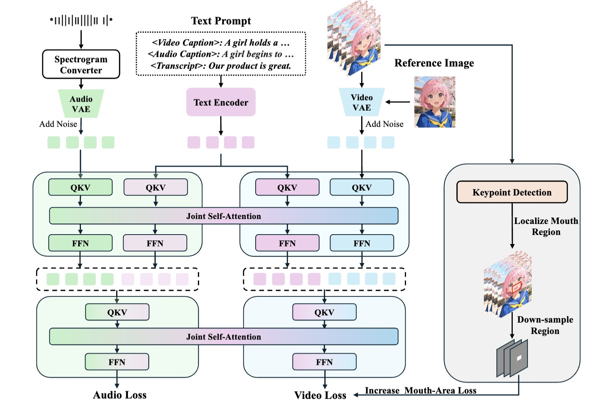

# JoVA: Unified Multimodal Learning for Joint Video-Audio Generation

[](https://arxiv.org/abs/2512.13677)
[](https://visual-ai.github.io/jova/)
[](https://arxiv.org/abs/2512.13677)

Xiaohu Huang<sup>\*</sup>, Hao Zhou<sup>\*</sup>, Qiangpeng Yang, Shilei Wen, Kai Han<sup>†</sup>  
The University of Hong Kong · ByteDance  

<sup>\*</sup>Equal contribution &nbsp;&middot;&nbsp; <sup>†</sup>Corresponding author


https://github.com/user-attachments/assets/96261603-d1a1-483a-acbc-c499b7eb8c22


---

## Overview


JoVA is a unified framework for **joint video-audio generation**, with a particular focus on **human speech synchronized with lip movements**.  
Unlike prior unified video-audio methods that rely on explicit fusion or modality-specific alignment modules (e.g., additional cross-attention stacks), JoVA enables direct cross-modal interaction by applying **joint self-attention over concatenated video, audio, and text tokens within each transformer layer**.

To further improve **fine-grained lip–speech synchronization**, JoVA introduces a simple yet effective **mouth-aware supervision** strategy based on facial keypoint detection, increasing training emphasis on the mouth region in the VAE latent space—without complicating the architecture.

---

## Visual Results

Please refer to the project page for qualitative results, demos, and additional visualizations:

- Project page: https://visual-ai.github.io/jova  

---

## Performance Benchmarks

### UniAvatar-Bench

| Method | LSE-C ↑ | WER ↓ | FD ↓ | KL ↓ | CS ↑ | CE ↑ | CU ↑ | PC ↓ | PQ ↑ | MS ↑ | AS ↑ | ID ↑ |
|---|---:|---:|---:|---:|---:|---:|---:|---:|---:|---:|---:|---:|
| Universe-1 | 1.62 | 0.37 | 1.04 | 0.83 | 0.16 | 3.68 | 3.90 | 2.12 | 4.39 | 0.43 | 0.42 | 0.82 |
| OVI | 6.41 | 0.23 | 0.75 | 0.66 | **0.30** | 5.00 | 5.67 | 1.75 | 5.77 | 0.94 | 0.41 | 0.75 |
| **JoVA (ours)** | **6.64** | **0.18** | **0.69** | **0.63** | 0.28 | **5.46** | **6.20** | **1.71** | **6.45** | **0.98** | **0.47** | 0.78 |

---

## Citation

If you find this work useful, please cite:

```bibtex
@article{huang2025jova,
  title   = {JoVA: Unified Multimodal Learning for Joint Video-Audio Generation},
  author  = {Huang, Xiaohu and Zhou, Hao and Yang, Qiangpeng and Wen, Shilei and Han, Kai},
  journal = {arXiv preprint},
  year    = {2025},
}
